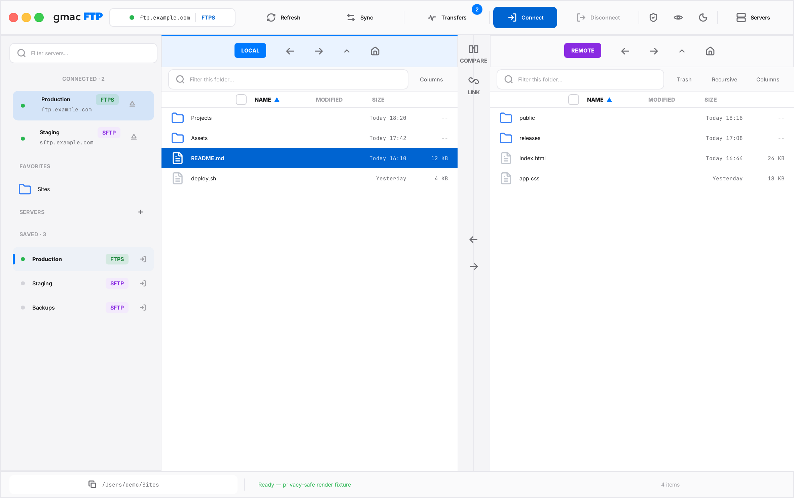
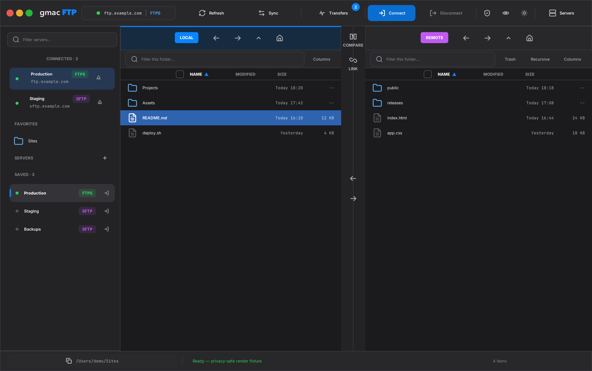
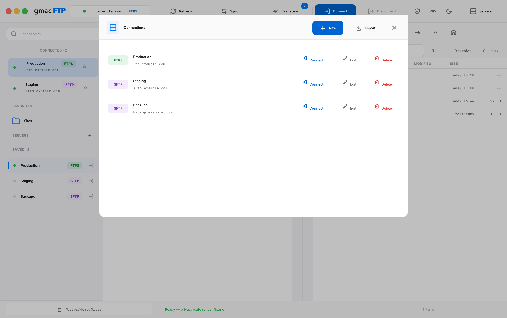
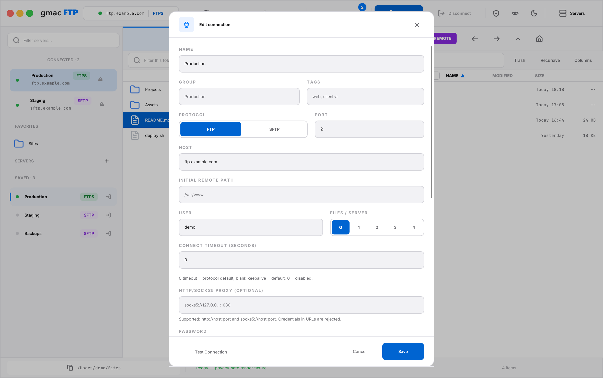
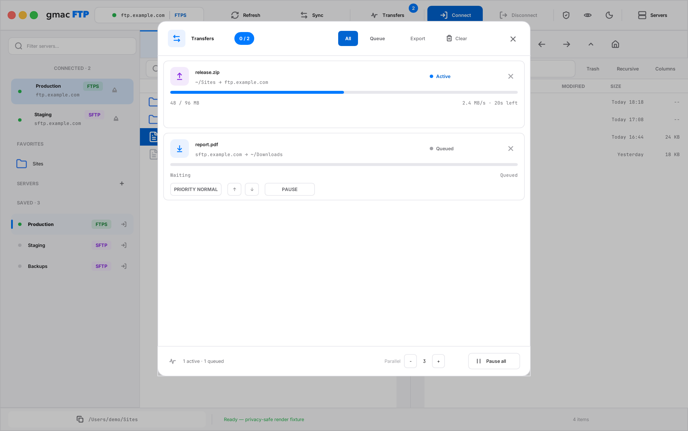

# gmacFTP

### The fast, secure, native FTP client for macOS.

Built in **Rust**. No Electron. No web view. No telemetry. Just a real macOS app that moves your
files — quickly and safely.

[](#)
[](#)
[](LICENSE)
[](#commercial-license)
[](#status)
[](https://buymeacoffee.com/gmac)



## ⬇️ Download & install

**[↓ Download gmacFTP for Mac — gmacFTP-0.2.1.dmg](https://github.com/GMAC-pl/gmacftp/releases/download/v0.2.1/gmacFTP-0.2.1.dmg)** · macOS 11+, Apple Silicon and Intel

1. Download the `.dmg`.
2. Open it and **drag gmacFTP into the Applications folder** (a shortcut is inside).
3. Open gmacFTP from **Applications**. On the first Keychain prompt, click **Always Allow**.

**Prefer Homebrew?**

```bash
brew install --cask gmac-pl/gmacftp/gmacftp
```

The same signed + Apple-notarized app as the DMG. Use the fully qualified command above so Homebrew selects the official gmacFTP tap.

Signed with an **Apple Developer ID** and **notarized by Apple** — opens cleanly with no warnings.

> 🧪 **Development preview (pre-1.0).** gmacFTP is early, but solid for everyday FTP / FTPS / SFTP
> work. Expect the occasional rough edge — feedback and bug reports are very welcome.

---

## English

### Why gmacFTP

- ⚡ **Fast.** Compiled Rust, not a wrapped browser. No runtime, no garbage collector, no Electron
  overhead — it cold-starts instantly and stays responsive under heavy transfers.
- 🔒 **Secure by design.** Passwords live in the macOS **Keychain** inside an AES-256-GCM vault;
  the master key never touches disk. FTPS is strict-by-default; SFTP verifies host keys.
- 🍎 **Genuinely native.** A universal macOS app: custom titlebar, native menu bar, drag-and-drop,
  light/dark themes, Apple Silicon and Intel. Not a web page in disguise.
- ☁️ **Yours everywhere.** Optionally sync your saved servers across your Macs via iCloud —
  passwords travel only as AES-256 ciphertext, with the master key in your Keychain.
- 🔓 **Open & private.** GPL-3.0 licensed (with a commercial option). No accounts, no cloud dependency you didn't ask for, no
  telemetry. Your servers stay yours.

### Download

**[⬇ gmacFTP-0.2.1.dmg](https://github.com/GMAC-pl/gmacftp/releases/download/v0.2.1/gmacFTP-0.2.1.dmg)** — install steps are at the top of this page.

Prefer to build it yourself? See [Build](#build).

### Features

- **Dual-pane** browser — independent left/right panes (local, remote, or two servers at once)
- **FTP**, **explicit or implicit FTPS**, and **SFTP** (pure-Rust SSH stack; password, private key, SSH Agent, keyboard-interactive/2FA, and safe `~/.ssh/config` aliases)
- Optional FTPS mutual TLS with a local PEM certificate chain + protected PKCS#8 key; bounded credential-free HTTP CONNECT/SOCKS5 proxy tunnels
- Pipelined SFTP, reused per-server sessions, parallel endpoints, and a live **transfer queue**
- Transactional local/FTP/FTPS/SFTP writes, resumable uploads/downloads, crash recovery, and
  per-file pause, cancel, priority, reorder, resume, and retry controls
- Finder-style multi-selection: **Command-A**, **Shift-click**, and **Command-click** for mixed file/folder batches
- Batch error recovery: skip a failed/locked file and continue, or stop only that copy batch
- Editable path bar, recent paths, remote Places, instant filtering, bounded recursive search,
  directory comparison, and synchronized browsing
- Create folders, batch rename, duplicate, copy/paste, move, inspect metadata, edit Unix
  permissions, and use a reversible **Remote Trash**; permanent server deletion stays explicit
- Open a remote file in its default macOS editor with concurrent-change protection
- Finder drag-and-drop in both directions plus privacy-safe macOS notifications and Dock transfer progress
- Saved one-way and opt-in mirror **folder sync** profiles with exclusions, comparison policies,
  mandatory dry-run, revalidation, and explicit deletion confirmation
- Native **Settings** for appearance, transfers, connections, synchronization, editors, privacy,
  storage, notifications, automatic updates, and workspace restoration
- **macOS Keychain** secret storage (master key never on disk)
- Optional **iCloud sync** of saved servers across your Macs (toggle in the app menu; if two Macs edit at once, the newest change wins)
- Connection manager, FileZilla `sitemanager.xml` + JSON import (including implicit-FTPS entries)
- Native macOS **menu bar** (App / File / Edit / View / Window / Help) + About panel
- Light/dark themes and a complete EN/PL UI that follows the macOS language by default
- VoiceOver semantics and complete keyboard control for custom buttons, lists, fields, dialogs, and transfers
- Optional once-per-launch update checks (off by default), plain-text release notes, and an explicit
  download choice; accepted DMGs must pass GitHub SHA-256, Developer ID, and Apple notarization checks

### Screenshots

|                                                  |                                                   |
| :----------------------------------------------: | :-----------------------------------------------: |
|         |            |
|                 Light workspace                  |                  Dark workspace                   |
|  |  |
|                Connection manager                |               New connection editor               |
|      |                                                   |
|                  Transfer queue                  |                                                   |

All screenshots use sample server names and placeholder credentials — never real data.

### Tech stack

- **Language:** Rust
- **UI:** Slint 1.x (`renderer-femtovg-wgpu` on macOS)
- **Runtime:** Tokio
- **FTP / FTPS:** `suppaftp` + native TLS (explicit/implicit TLS and optional client certificates)
- **SFTP:** `russh` + `russh-sftp`
- **Secrets:** AES-256-GCM vault; master key in the macOS Keychain (not a plaintext file)
- **Persistence:** JSON metadata in the app config directory

See [`docs/ARCHITECTURE.md`](docs/ARCHITECTURE.md) for the layer breakdown.

### Build

Requirements: macOS 11+, Rust 1.88+, Xcode Command Line Tools.

```sh
cargo run --release
```

Build the native `.app` bundle:

```sh
bash scripts/build-app.sh
open target/release/gmacFTP.app
```

The public bundle is universal (`arm64 + x86_64`). The script installs a missing Rust target when
`rustup` is available, verifies both architectures with `lipo`, and only then signs the app.

Both panes start as your local filesystem, so you can try navigation, selection, sorting, the
connection manager, and local copy flows with no server at all.

### Privacy & security

- No telemetry and no accounts. Apart from servers you configure, the public build contacts GitHub
  Releases only when you choose **Check for Updates** or explicitly enable the once-per-launch check.
  No stable user/device identifier is sent and every download still requires confirmation. (iCloud
  sync is opt-in, off by default; the master key lives in the Keychain — your connections + the
  AES-256 vault mirror as plain files in your iCloud Drive.)
- `data/`, `.env*`, build artifacts, and local tool state are gitignored; this repo contains no
  private data.
- Passwords are never stored in connection metadata.

More in [`docs/PRIVACY.md`](docs/PRIVACY.md) and [`SECURITY.md`](SECURITY.md).

### Status

gmacFTP is a **development preview (pre-1.0)**. Version 0.2 adds resilient transactional transfers,
power-user file management, native settings, accessibility, and universal Mac support; feedback now
focuses on broad server compatibility and UI polish before 1.0.

### Support gmacFTP

gmacFTP is free and open source. If it saves you time, a coffee is greatly appreciated ☕

[](https://buymeacoffee.com/gmac)

### License

gmacFTP is dual-licensed:

- **GPL v3** — for personal use, open-source projects, and anyone who open-sources their own
  application. Free.
- **Commercial License** — for embedding gmacFTP into a closed-source / proprietary product without
  GPL obligations. Contact [GMAC](https://gmac.pl/kontakt/) for terms and pricing.

See [LICENSE](LICENSE) for the full GPL v3 text.

#### Commercial license

If you want to use gmacFTP (or parts of it) inside a product you do **not** open-source, the GPL v3
requires you to also release your code under GPL. To avoid that, you can purchase a commercial
license that lifts the copyleft obligation.

**[Contact GMAC →](https://gmac.pl/kontakt/)**

---

## Polski

### Szybki, bezpieczny, natywny klient FTP dla macOS.

Napisany w **Ruście**. Bez Electrona, bez web view, bez telemetrii. Prawdziwa aplikacja macOS,
która po prostu przenosi Twoje pliki — szybko i bezpiecznie.

> 🧪 **Wersja rozwojowa (pre-1.0).** gmacFTP jest wczesny, ale stabilny do codziennych transferów
> FTP / FTPS / SFTP. Licz się z drobnymi niedoskonałościami — feedback bardzo mile widziany.

### Dlaczego gmacFTP

- ⚡ **Szybki.** Skompilowany Rust, nie opakowana przeglądarka — bez runtime'u, bez GC, bez
  narzutu Electrona. Uruchamia się natychmiast i nie zacina przy dużych transferach.
- 🔒 **Bezpieczny.** Hasła w macOS **Keychain** w zaszyfrowanym vaultcie AES-256-GCM; klucz główny
  nigdy nie ląduje na dysku. FTPS strict-by-default; SFTP weryfikuje klucze hostów.
- 🍎 **Natywny.** Uniwersalna apka macOS: własny titlebar, natywne menu, drag-and-drop,
  jasny/ciemny motyw, Apple Silicon i Intel.
- ☁️ **Twój wszędzie.** Opcjonalna synchronizacja zapisanych serwerów przez iCloud — hasła
  przesyłane są tylko jako zaszyfrowany szyfrogram (AES-256), a klucz mistrzowski zostaje w
  Keychainie.
- 🔓 **Otwarty i prywatny.** Licencja GPL-3.0 (z opcją komercyjną), bez kont, bez telemetrii.

### Pobranie i instalacja

**[⬇ Pobierz gmacFTP dla Maca — gmacFTP-0.2.1.dmg](https://github.com/GMAC-pl/gmacftp/releases/download/v0.2.1/gmacFTP-0.2.1.dmg)** · macOS 11+, Apple Silicon i Intel

1. Pobierz plik `.dmg`.
2. Otwórz go i **przeciągnij gmacFTP do folderu Aplikacje** (skrót jest w środku).
3. Uruchom gmacFTP z **Aplikacji**. Przy pierwszym monicie Keychaina kliknij **Zawsze pozwalaj**.

**Wolisz Homebrew?**

```bash
brew install --cask gmac-pl/gmacftp/gmacftp
```

Ta sama, podpisana i zanotaryzowana przez Apple apka co DMG. Użyj pełnej komendy powyżej, aby Homebrew wybrał oficjalny tap gmacFTP.

Podpisana **Apple Developer ID** i **zanotaryzowana przez Apple** — uruchamia się czysto, bez ostrzeżeń.

### Funkcje

- **Dwupanelowa** przeglądarka — niezależne panele (lokalny, zdalny albo dwa serwery naraz)
- **FTP**, **FTPS** (explicit lub implicit TLS) i **SFTP** (SSH w czystym Ruście; hasło, klucz, SSH Agent, keyboard-interactive/2FA i bezpieczne aliasy `~/.ssh/config`)
- Opcjonalne wzajemne TLS dla FTPS z lokalnym łańcuchem certyfikatów PEM i chronionym kluczem PKCS#8; ograniczone tunele proxy HTTP CONNECT/SOCKS5 bez danych logowania
- Potokowe SFTP, współdzielone sesje per serwer, równoległe endpointy i live **kolejka transferów**
- Transakcyjne zapisy lokalne/FTP/FTPS/SFTP, wznawianie wysyłania i pobierania, odzyskiwanie po
  restarcie oraz pauza, priorytet, kolejność, anulowanie i ponawianie pojedynczych zadań
- Zaznaczanie jak w Finderze: **Command-A**, **Shift+klik** i **Command+klik** dla mieszanych partii plików i folderów
- Obsługa błędów partii: pominięcie uszkodzonego/zablokowanego pliku albo przerwanie tylko tej partii
- Edytowalny pasek ścieżki, ostatnie lokalizacje, zdalne Miejsca, szybki filtr, ograniczone
  wyszukiwanie rekurencyjne, porównywanie katalogów i zsynchronizowane przeglądanie
- Tworzenie folderów, seryjna zmiana nazw, duplikowanie, kopiuj/wklej, przenoszenie, Inspektor,
  edycja uprawnień i odwracalny **zdalny Kosz**; trwałe usuwanie z serwera pozostaje jawne
- Otwieranie zdalnego pliku w domyślnej aplikacji z ochroną przed równoczesną zmianą na serwerze
- Drag-and-drop z Finderem w obie strony, prywatne powiadomienia macOS i postęp transferów w Docku
- Zapisane profile jednokierunkowej **synchronizacji folderów** oraz opcjonalny tryb lustrzany z
  wykluczeniami, politykami porównania, obowiązkowym dry-run i jawnym potwierdzeniem usuwania
- Natywne **Ustawienia** wyglądu, transferów, połączeń, synchronizacji, edytorów, prywatności,
  pamięci, powiadomień, aktualizacji i odtwarzania obszaru roboczego
- Sekrety w **macOS Keychain** (klucz główny nigdy na dysku)
- Opcjonalna **synchronizacja iCloud** zapisanych serwerów między Macami (przełącznik w menu; przy jednoczesnej edycji na dwóch Macach wygrywa najnowsza zmiana)
- Menedżer połączeń, import z FileZilla `sitemanager.xml` + JSON (także wpisy implicit FTPS)
- Natywne **menu** macOS (App / File / Edit / View / Window / Help) + panel About
- Jasny/ciemny motyw oraz pełny interfejs EN/PL, domyślnie zgodny z językiem macOS
- Role i opisy VoiceOver oraz pełna obsługa klawiaturą własnych przycisków, list, pól, okien i transferów
- Opcjonalne sprawdzanie aktualizacji raz po uruchomieniu (domyślnie wyłączone), informacje o wydaniu
  jako zwykły tekst i osobna zgoda na pobranie; DMG musi przejść kontrolę SHA-256, Developer ID i notaryzacji Apple

### Zrzuty ekranu

|                                                  |                                                   |
| :----------------------------------------------: | :-----------------------------------------------: |
|         |            |
|               Jasny obszar roboczy               |               Ciemny obszar roboczy               |
|  |  |
|                Menedżer połączeń                 |             Edytor nowego połączenia              |
|      |                                                   |
|                Kolejka transferów                |                                                   |

Wszystkie zrzuty używają przykładowych nazw serwerów i zastępczych danych — nigdy realnych.

### Stos techniczny

- **Język:** Rust
- **UI:** Slint 1.x (`renderer-femtovg-wgpu` na macOS)
- **Runtime:** Tokio
- **FTP / FTPS:** `suppaftp` + native TLS (explicit/implicit TLS i opcjonalne certyfikaty klienta)
- **SFTP:** `russh` + `russh-sftp`
- **Sekrety:** vault AES-256-GCM; klucz główny w macOS Keychain (nie jako plik tekstowy)
- **Trwałość:** metadane JSON w katalogu konfiguracyjnym aplikacji

Patrz [`docs/ARCHITECTURE.md`](docs/ARCHITECTURE.md).

### Budowanie

Wymagania: macOS 11+, Rust 1.88+, Xcode Command Line Tools.

```sh
cargo run --release
# bundle .app:
bash scripts/build-app.sh
open target/release/gmacFTP.app
```

Publiczny bundle jest uniwersalny (`arm64 + x86_64`); przed podpisaniem skrypt sprawdza obie
architektury przez `lipo`.

Oba panele startują jako Twój lokalny filesystem, więc możesz wypróbować nawigację, zaznaczanie,
sortowanie, menedżer połączeń i lokalne kopiowanie bez żadnego serwera.

### Prywatność i bezpieczeństwo

- Brak telemetrii i kont. Poza podanymi serwerami publiczna wersja łączy się z GitHub Releases tylko
  po wybraniu **Sprawdź aktualizacje** albo po jawnym włączeniu jednego sprawdzenia po starcie. Nie
  wysyła stałego identyfikatora użytkownika ani urządzenia, a każde pobranie wymaga potwierdzenia.
  (Synchronizacja iCloud jest opcjonalna, domyślnie wyłączona; w Keychainie jest tylko klucz
  mistrzowski — dane serwerów synchronizują się jako zwykłe pliki w folderze iCloud Drive.)
- `data/`, `.env*`, artefakty builda i stan narzędzi są gitignorowane; repo nie zawiera prywatnych danych.
- Hasła nigdy nie trafiają do metadanych połączeń.

Więcej: [`docs/PRIVACY.md`](docs/PRIVACY.md) oraz [`SECURITY.md`](SECURITY.md).

### Status

gmacFTP to **wersja rozwojowa (pre-1.0)**. Wersja 0.2 dodaje odporne transakcyjne transfery,
zaawansowane zarządzanie plikami, natywne ustawienia, dostępność i obsługę wszystkich współczesnych
Maców; przed 1.0 skupiamy się na szerokiej kompatybilności serwerów i dopracowaniu UI.

### Wesprzyj gmacFTP

gmacFTP jest darmowy i open source. Jeśli oszczędza Ci czas — postaw mi kawę, bardzo dziękuję ☕

[](https://buymeacoffee.com/gmac)

### Licencja

gmacFTP jest na licencji podwójnej (dual-license):

- **GPL v3** — do użytku osobistego, projektów open-source i dla wszystkich, którzy udostępniają
  swój kod. Za darmo.
- **Licencja komercyjna** — dla osadzenia gmacFTP w produkcie zamkniętym / własnościowym bez
  zobowiązań GPL. Skontaktuj się z [GMAC](https://gmac.pl/kontakt/) w sprawie warunków i cen.

Pełny tekst GPL v3: [LICENSE](LICENSE).

#### Licencja komercyjna

Jeśli chcesz użyć gmacFTP (lub jego fragmentów) w produkcie, którego **nie** udostępniasz jako
open-source, licencja GPL v3 wymaga udostępnienia Twojego kodu pod GPL. Aby tego uniknąć, możesz
kupić licencję komercyjną, która znosi ten obowiązek.

**[Skontaktuj się z GMAC →](https://gmac.pl/kontakt/)**
